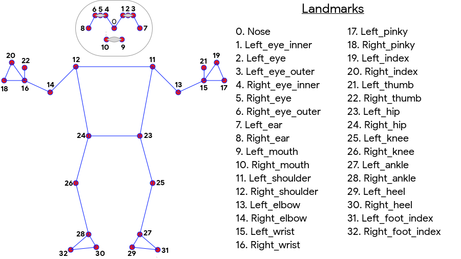

# Exercise Tracking With Computer Vision
By: Alonzo Mays
___
### Outline
___

### I. Problem Statement
### II. Data Dictionary
### III. EDA
### IV. Modeling
### V. Conclusion/Recommendation
___
### Problem Statement
Learning yoga can be difficult when
you start the practice. Beginning
yoga students need help with doing
basic poses (tree pose, mountain
pose) in order to reduce injury and
condition their bodies to become
proficient practitioners.
### Data Dictionary
https://developers.google.com/ml-kit/vision/pose-detection
### EDA

### Modeling
<a href>https://google.github.io/mediapipe/solutions/models#object-detection</a>

### Conclusion/Future Considerations

*GAMIFICATION*   
▪ Uses verbal cues for correct or
incorrect posture   
▪ Keep a running score, add social
component to program   
*ADDITIONAL POSES*   
▪ Current heuristic approach is ok for 1-2
poses   
▪ Training 100+ images of several poses
would be more efficient
